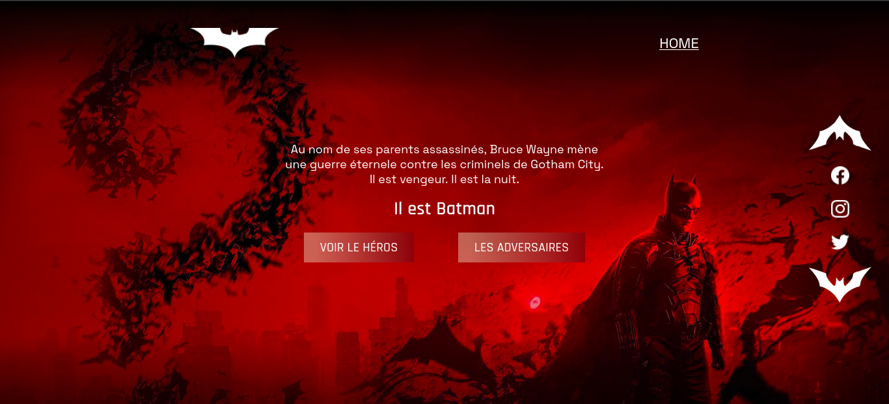

# BATMAN
This project focuses on development skills in HTML/CSS. These are basic languages for learning computer development, particularly for building websites.

The aim is to build a responsive site, mobile and desktop version, on the BATMAN universe (DC Extended Universe - DCEU).

You can find the online project [here](https://batman-cc7h.onrender.com/)

## Demo

    
    
    

